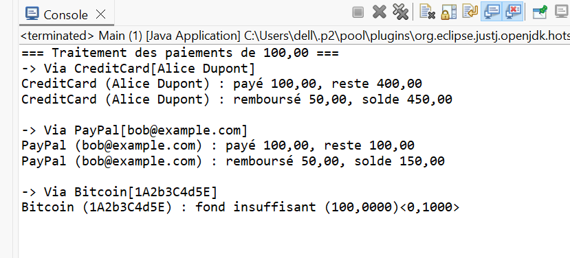
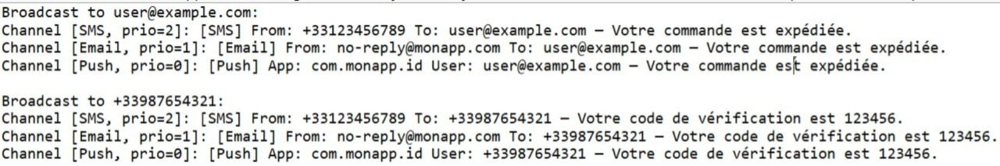

# TP Java POO : Systèmes Extensibles

## Exercice 1 : Système de paiement extensible

### Objectifs pédagogiques
- Comprendre le rôle des interfaces en Java pour définir des contrats indépendants des implémentations.
- Découpler le code métier des détails de chaque moyen de paiement.
- Gérer dynamiquement un tableau d’objets hétérogènes.
- Ajouter un nouveau moyen de paiement sans modifier le gestionnaire existant.

### Fonctionnalités
- Gestion de plusieurs moyens de paiement : carte bancaire, PayPal, Bitcoin.
- Traitement de paiements et remboursements partiels.
- Tableau dynamique pour stocker les méthodes de paiement.

### Résultat attendu
- Paiements réussis ou échoués selon le solde disponible.
- Affichage clair des transactions et des soldes après chaque opération.

  

## Exercice 2 : Système de notification extensible

### Objectifs pédagogiques
- Définir et implémenter une interface Java pour les notifications.
- Découpler la logique métier de l’envoi des messages des canaux concrets.
- Gérer un tableau dynamique de canaux de notification.
- Appliquer un tri par priorité des messages.

### Fonctionnalités
- Canaux de notification : Email, SMS, Push.
- Diffusion de messages à plusieurs destinataires.
- Tri des canaux selon la priorité avant envoi.

### Résultat attendu
- Les messages sont envoyés dans l’ordre des priorités (SMS > Email > Push).
- Les notifications sont clairement affichées avec le canal utilisé et le destinataire.

  

